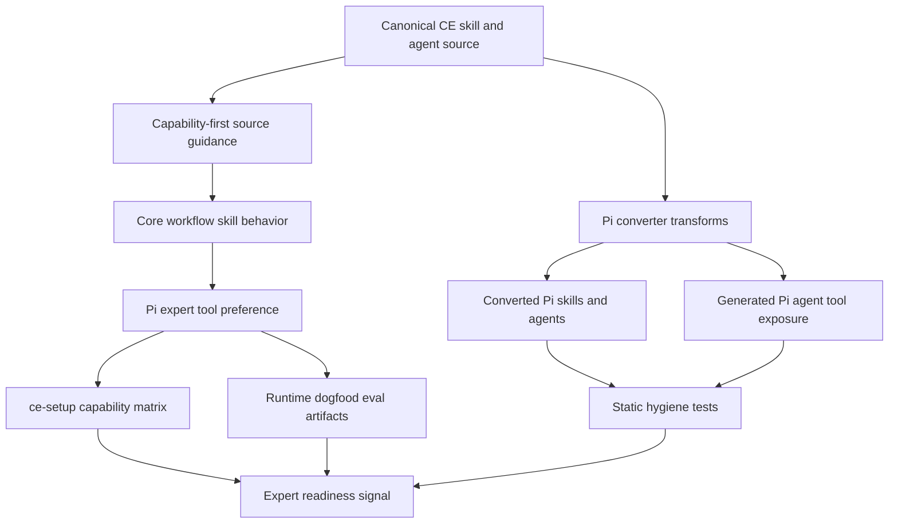
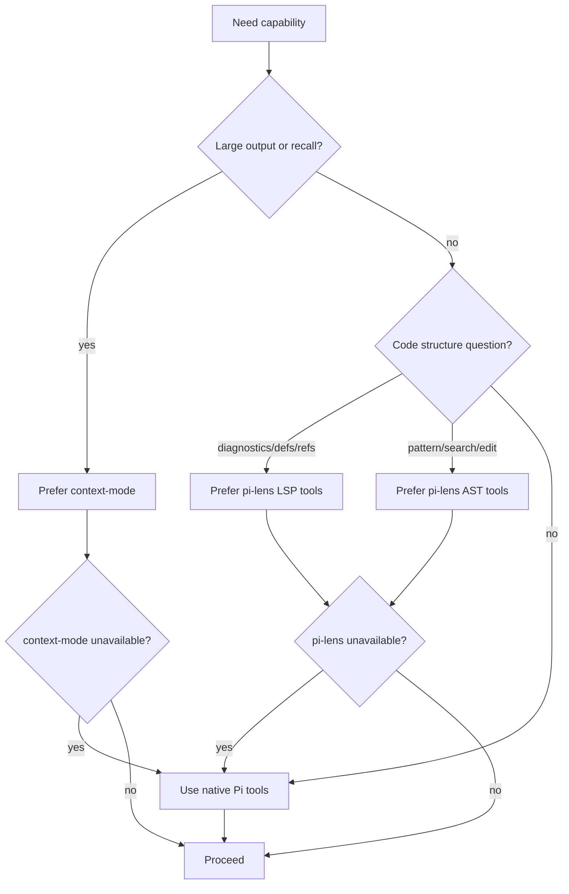

# feat: Improve Pi expert workflow tooling

## Summary

Improve the Compound Engineering Pi experience for an expert Pi user by making core workflows prefer the installed Pi toolchain, adding a Pi capability matrix, proving behavior with dogfood/eval artifacts, and tightening converted Pi output so Claude-only instructions do not leak into runtime guidance.

---

## Problem Frame

The Pi target already installs Compound Engineering skills and agents into Pi-owned roots and relies on community extensions for subagents, structured questions, task tracking, and web access. The gap is quality of use: core skills still read like platform-neutral or Claude-first workflows, the setup diagnostic does not report Pi capability readiness, runtime validation mostly proves files are written rather than workflows behave well, and converted Pi output can retain legacy `ToolSearch` / `pi-ask-user` / raw task-tool wording. This plan intentionally optimizes for a user who already knows Pi and uses `/skill:`; slash aliases, new-user onboarding, and native Pi package distribution stay out of scope.

---

## Requirements

**Pi expert workflow behavior**

- R1. Core Compound Engineering workflows prefer Pi-native installed tools when available: `subagent`, `todo`, `ctx_*`, `ast_grep_*`, `lsp_*`, `web_search`, and `fetch_content`.
- R2. Optional Pi accelerators degrade clearly when unavailable; absence of `context-mode` or `pi-lens` must not make a workflow impossible.
- R3. Question flows preserve the current blocking-question contract while respecting Pi `ask_user_question` option limits and numbered-list fallback behavior.
- R4. Converted Pi agents can access the optional expert tools that their instructions recommend, or the generated output clearly scopes those recommendations to the primary workflow when agent tool exposure is unavailable.

**Diagnostics and evidence**

- R5. `ce-setup` reports a Pi capability matrix that distinguishes core delegation readiness, structured questions, task tracking, web research, context compression, code intelligence, and converted CE artifact presence.
- R6. The Pi capability matrix uses stable statuses such as blocked, degraded, full, missing, installed, and active-or-unverified without turning optional accelerators into generic setup failures.
- R7. Runtime dogfood/eval artifacts define a repeatable Pi smoke matrix across missing, partial, accelerator-absent, accelerator-present, and stale-session states without requiring CI to mutate the user's real Pi home.
- R8. Tests cover both static converted-output hygiene and the script/report contracts behind the Pi capability matrix and dogfood artifacts.

**Converter and authoring hygiene**

- R9. Pi-converted output removes or normalizes Claude-only and legacy Pi instructions such as `ToolSearch` preload/fallback language, `pi-ask-user`, `ask_user` in Pi, and raw Claude task-tracking primitives.
- R10. Future skill edits are guided by current Pi tool names so stale authoring guidance does not reintroduce legacy wording.
- R11. Existing Pi writer layout, manifest cleanup, managed artifact safety, root resolution, and MCPorter behavior remain unchanged.

---

## Scope Boundaries

### In Scope

- Expert-user Pi tool strategy in runtime skill guidance and Pi compatibility injection.
- `ce-setup` capability matrix for Pi readiness and degraded states.
- Static and lightweight runtime-oriented dogfood/eval artifacts for Pi workflows.
- Converter and writer tests that scan real compound-engineering Pi output for stale Claude-only or legacy Pi wording.
- Authoring guidance updates that prevent future stale Pi prose.

### Deferred to Follow-Up Work

- Slash command aliases such as `/ce-plan` wrappers for Pi prompt templates.
- A native Pi package distribution path independent of the current converter-backed install flow.
- Full Pi runtime CI that launches interactive Pi sessions across every extension combination.
- Broad README onboarding rewrite for brand-new Pi users.

---

## Key Technical Decisions

- **Canonical source stays capability-first; Pi output gets exact Pi names:** Source skills should describe capability-level behavior with platform examples only where useful. Exact Pi package/tool names belong in Pi compatibility notes, Pi converter normalization, managed Pi guidance, diagnostics, and Pi-output tests so non-Pi targets do not inherit Pi-only instructions by accident.
- **Extend `ce-setup` for the Pi doctor matrix:** Use the existing script-first setup diagnostic rather than adding a new `ce-doctor` skill. This avoids a new entry point and keeps environment health checks in the place users already run for Compound Engineering readiness.
- **Separate readiness status from setup issue counts:** Missing `pi-subagents` should block delegated Pi workflows; missing `context-mode` or `pi-lens` should report degraded capability, not an unhealthy installation. The Pi matrix should be an expert readiness contract, not a new installer flow.
- **Mirror Pi root semantics in diagnostics:** The matrix should accept an explicit Pi root using the existing `--pi-home` vocabulary, then fall back to supported project/global roots. Root detection must not invent a path shape that the writer does not support.
- **Treat context-mode and pi-lens as accelerators, not hard dependencies:** `context-mode` and `pi-lens` should be preferred when installed, but workflows still need native `read`, `bash`, and file-search fallbacks so converted Pi output remains usable in lean environments.
- **Use one capability taxonomy everywhere:** The plan should standardize the routing vocabulary in the Capability Taxonomy section. Skills, converter guidance, `ce-setup`, and dogfood grading should use those row names rather than near-synonyms.
- **Make converted-agent tool exposure explicit:** If generated Pi agent frontmatter restricts tools, the converter must either expose the optional expert tools that the agent is instructed to use or keep those recommendations scoped to the primary workflow. Tests should prove converted agents are not told to use tools they cannot access.
- **Static CI gates plus one runtime evidence pass:** CI should deterministically validate conversion, hygiene, and diagnostic output. At least one manual Pi dogfood evidence pass should be captured before merge so the core premise is tested in an active Pi session without requiring every CI run to launch Pi interactively.
- **Preserve existing Pi install semantics:** Do not change `.pi/skills`, `.pi/agents`, `.pi/prompts`, plugin-scoped managed files, manifest cleanup, or MCPorter config behavior; the work is about quality and diagnostics, not output layout.

---

## Capability Taxonomy

| Capability row | Pi tool names when active | Fallback / degraded behavior |
|---|---|---|
| Subagent delegation | `subagent` | Delegated workflows are blocked or must run without persona fan-out. |
| Structured questions | `ask_user_question` | Use numbered-list chat fallback, especially for 5+ option or multi-select cases. |
| Task tracking | `todo` | Keep task state in the skill transcript or a local TODO artifact when the tool is absent. |
| Web research | `web_search`, `fetch_content`, `code_search`, `get_search_content` | Proceed from local repo evidence and state the missing external context when web tools are unavailable. |
| Large-output compression | `ctx_batch_execute`, `ctx_execute`, `ctx_execute_file` | Use bounded native shell/read patterns and print summaries rather than raw large output; tool errors fall back, empty results are data. |
| Persistent/session recall | `ctx_search`, `ctx_index` | Fall back to repo docs, session-visible context, and explicit file reads; no matches are reported as no matches, not as tool failure. |
| Symbol diagnostics/navigation | `lsp_diagnostics`, `lsp_navigation` | Fall back to targeted source reads and native search on tool error; empty diagnostics remain a valid result. |
| Structural search/edit | `ast_grep_search`, `ast_grep_replace` | Fall back to careful text search/edit with narrower scopes on tool error; zero matches should trigger a simpler structural query before fallback. |
| CE artifact presence | `.pi` skills, agents, prompts, managed manifest | Report missing/degraded artifact state; do not treat optional accelerators as missing CE artifacts. |

---

## High-Level Technical Design





The implementation should make the runtime guidance and converter output reinforce each other: source skills describe capability-level choices, the Pi converter normalizes platform-specific wording, generated agents are not over-restricted relative to their guidance, the setup matrix reports whether those capabilities are active or degraded, and dogfood artifacts define how to verify the whole loop in a Pi session.

---

## Output Structure

The plan adds a small dogfood/eval subtree, modeled after the existing eval-suite pattern:

```text
plugins/compound-engineering/skills/ce-dogfood-beta/evals/pi-workflows/
  README.md
  evals.json
  grader.md
```

This location is mandatory for this plan so the eval suite is discoverable beside the dogfood skill. Keep the same separation between test cases, grading rubric, and operator instructions.

---

## Implementation Units

### U1. Update Pi authoring, compatibility guidance, and tool exposure

- **Goal:** Establish current Pi tool vocabulary, expert-user posture, and generated-agent tool exposure in the surfaces that guide future skill edits and converted runtime behavior.
- **Requirements:** R1, R2, R3, R4, R10, R11
- **Dependencies:** None
- **Files:**
  - `plugins/compound-engineering/AGENTS.md`
  - `src/converters/claude-to-pi.ts`
  - `src/targets/pi.ts`
  - `tests/pi-converter.test.ts`
  - `tests/pi-writer.test.ts`
- **Approach:** Replace stale Pi authoring references with `ask_user_question` / `@juicesharp/rpiv-ask-user-question`, keep subagent guidance anchored to `pi-subagents`, and expand Pi compatibility notes to include context-mode and pi-lens as optional expert accelerators. Audit Pi generated agent `tools` frontmatter so optional expert tools are exposed when the generated agent is expected to use them; avoid blanket tool grants unless Pi's semantics require them. Keep the writer's managed paths and manifest behavior unchanged.
- **Patterns to follow:** Existing `buildPiToolCompatibilityNote()` in `src/converters/claude-to-pi.ts`; existing managed `AGENTS.md` block in `src/targets/pi.ts`; existing Pi converter tests for tool mapping and MCPorter config.
- **Test scenarios:**
  - Convert a fixture agent that declares Claude-style tools and assert the Pi frontmatter/tool note lists Pi equivalents without introducing unsupported tool names.
  - Convert a fixture agent that declares context-mode or pi-lens style tools and assert generated Pi tool exposure matches the runtime guidance.
  - Write a Pi bundle and assert the managed `AGENTS.md` block includes required, recommended, and optional expert accelerators while preserving existing upsert behavior.
  - Re-run writer tests for stale managed artifacts to ensure guidance changes do not affect cleanup semantics.
- **Verification:** Pi conversion and writer tests pass; generated Pi guidance names current Pi packages and does not mention legacy `pi-ask-user` or `ask_user` as the Pi question tool; generated agents are not instructed to use tools their frontmatter excludes.

### U4. Tighten Pi converter cleanup and full-output hygiene tests

- **Goal:** Ensure converted compound-engineering Pi output no longer contains misleading Claude-only or legacy Pi tool instructions, and positively points to Pi equivalents where appropriate.
- **Requirements:** R3, R4, R8, R9, R10, R11
- **Dependencies:** U1
- **Files:**
  - `src/converters/claude-to-pi.ts`
  - `tests/pi-converter.test.ts`
  - `tests/pi-writer.test.ts`
  - `tests/manifest-path-safety.test.ts`
- **Approach:** Add the full-plugin output scan before broad skill edits land, then expand `transformContentForPi()` only for known stale patterns. The scan installs `plugins/compound-engineering` into a temp Pi root and scans all runtime markdown outputs: copied skills, references, agents, prompts, managed `AGENTS.md`, and eval markdown. Keep rewrite rules surgical so slash-shaped paths, URLs, and legitimate cross-platform examples are not corrupted. Add agent manifest path-safety coverage if current tests only cover skills, prompts, and extensions. Rewrite the converter-injected compatibility note so forbidden-token checks do not conflict with intentional mapping prose.
- **Patterns to follow:** Existing targeted replacements and slash command normalization in `src/converters/claude-to-pi.ts`; existing Pi writer tests that copy fixture skill markdown through `transformContentForPi()`.
- **Test scenarios:**
  - Fixture conversion rewrites `AskUserQuestion` Pi references to `ask_user_question` and removes `ToolSearch` preload/fallback semantics.
  - Full compound-engineering Pi install output contains no `pi-ask-user`, no Pi `ask_user`, no `ToolSearch` preload/fallback remnants, and no raw instructional `TaskCreate` / `TodoWrite` task-tracking remnants in runtime markdown.
  - Converter-injected compatibility prose positively references `todo` where task tracking is discussed and avoids raw Claude task-tool names unless they appear only inside an explicitly allowed mapping fixture.
  - Full compound-engineering Pi output positively references Pi web tools where web research is discussed and includes fallback wording when web access is unavailable.
  - A fixture containing ordinary slash paths or URLs is unchanged by command-name normalization.
  - Tampered manifest `agents` entries with traversal or absolute paths are ignored like unsafe skills/prompts/extensions entries.
- **Verification:** Pi converter and writer tests fail on stale tool wording, pass on positive Pi-equivalent wording, and pass without changing managed output layout.

### U2. Tune core workflow skills for Pi expert tools

- **Goal:** Make the highest-value Compound Engineering workflows explicitly prefer the current Pi toolchain for large-output handling, structural code understanding, task tracking, and delegation.
- **Requirements:** R1, R2, R3, R4, R8
- **Dependencies:** U1, U4
- **Files:**
  - `plugins/compound-engineering/skills/ce-brainstorm/SKILL.md`
  - `plugins/compound-engineering/skills/ce-plan/SKILL.md`
  - `plugins/compound-engineering/skills/ce-work/SKILL.md`
  - `plugins/compound-engineering/skills/ce-work-beta/SKILL.md`
  - `plugins/compound-engineering/skills/ce-debug/SKILL.md`
  - `plugins/compound-engineering/skills/ce-code-review/SKILL.md`
  - `plugins/compound-engineering/skills/ce-doc-review/SKILL.md`
  - `plugins/compound-engineering/skills/ce-simplify-code/SKILL.md`
  - `plugins/compound-engineering/skills/ce-sessions/SKILL.md`
  - `plugins/compound-engineering/skills/ce-compound/SKILL.md`
  - `plugins/compound-engineering/skills/ce-compound-refresh/SKILL.md`
  - `tests/pi-tool-guidance-contract.test.ts`
- **Approach:** Add narrowly scoped capability-first runtime guidance where each workflow already discusses tool choice, then rely on Pi conversion/output tests for exact Pi names. Planning/brainstorm/review/session research should prefer large-output compression, persistent recall, and web research when those capabilities are active; implementation/debug/review should prefer symbol diagnostics/navigation and structural search/edit; long multi-step flows should use task tracking; subagent dispatch should use delegation. Keep `ce-work-beta` synchronized with `ce-work` unless implementation deliberately records a no-sync decision with test coverage.
- **Execution note:** Make this a text-contract change first: add contract tests before editing multiple skill files so regressions in Pi guidance are visible.
- **Patterns to follow:** Project rule that each skill directory is self-contained; existing platform-neutral wording in `ce-plan` and `ce-doc-review`; existing review contract tests that assert load-bearing prose; beta-skill sync guidance in `plugins/compound-engineering/AGENTS.md`.
- **Test scenarios:**
  - Assert canonical skills use capability-row vocabulary without requiring exact Pi-only tool names in non-Pi source prose.
  - Assert converted Pi output names `context-mode`, pi-lens, `todo`, `subagent`, and web tools where the corresponding capability is discussed.
  - Assert code-workflow skills mention symbol diagnostics/navigation and structural search/edit with fallback wording.
  - Assert optional accelerator guidance distinguishes unavailable tools, tool errors, and empty/no-match results.
  - Assert session/compound workflows route persistent recall and indexed content through the capability taxonomy when available.
  - Assert question-heavy skills preserve numbered-list fallback for Pi 5-option or multi-select cases.
  - Assert `ce-work` and `ce-work-beta` are either synchronized for this guidance or explicitly covered by a no-sync decision.
  - Assert no new skill reference points outside its own directory tree.
- **Verification:** Contract tests prove the core skills carry Pi expert strategy; manual review confirms the guidance is capability-oriented in source and exact-tool-specific only in Pi output.

### U3. Add Pi capability matrix to ce-setup

- **Goal:** Let an expert Pi user quickly see whether the current session can run CE workflows at full, degraded, or blocked capability.
- **Requirements:** R5, R6, R8, R11
- **Dependencies:** U1, U4
- **Files:**
  - `plugins/compound-engineering/skills/ce-setup/SKILL.md`
  - `plugins/compound-engineering/skills/ce-setup/scripts/check-health`
  - `tests/skills/ce-setup-check-health.test.ts`
- **Approach:** Extend the existing non-mutating health script with a Pi section that checks package/tool availability and converted CE artifact presence. Report the exact rows from the Capability Taxonomy section. Add an explicit root input using the existing `--pi-home` vocabulary, then fall back to workspace `.pi` and default `$HOME/.pi/agent`. Keep Pi matrix statuses separate from generic Tools/Skills issue counts unless a missing required capability blocks delegated CE workflows. Distinguish installed-on-disk, active-or-unverified, and missing where a shell script cannot prove active session exposure.
- **Patterns to follow:** Existing `deps` / `skills` arrays and formatted health report in `plugins/compound-engineering/skills/ce-setup/scripts/check-health`; existing setup tests that create temp homes and fake tools; Pi writer path resolution in `src/targets/pi.ts`.
- **Test scenarios:**
  - With an empty temp HOME, the health script reports Pi capabilities as missing/degraded without failing the whole script.
  - With fake Pi package directories under a temp Pi home, the matrix reports installed capabilities and distinguishes required delegation from optional accelerators.
  - With `--pi-home` pointing at a temp root, the matrix probes that root before defaults.
  - With temp `.pi/agent/skills`, `.pi/agent/agents`, and managed manifest populated, the matrix reports CE artifact presence.
  - With a workspace `.pi` root, the matrix detects the supported root shape rather than falsely reporting missing artifacts.
  - Existing CLI tools and agent-skill checks still produce the same summary counts for non-Pi rows.
- **Verification:** `ce-setup` output includes a Pi capability matrix, remains parseable in tests, and exits successfully for diagnostic-only missing optional tools.

### U5. Add Pi runtime dogfood/eval artifacts

- **Goal:** Define repeatable evidence for whether the expert Pi workflow actually behaves well in runtime, beyond static conversion tests.
- **Requirements:** R7, R8
- **Dependencies:** U2, U3, U4
- **Files:**
  - `plugins/compound-engineering/skills/ce-dogfood-beta/evals/pi-workflows/README.md`
  - `plugins/compound-engineering/skills/ce-dogfood-beta/evals/pi-workflows/evals.json`
  - `plugins/compound-engineering/skills/ce-dogfood-beta/evals/pi-workflows/grader.md`
  - `tests/pi-runtime-dogfood-contract.test.ts`
- **Approach:** Add a skill-owned eval suite that specifies the smoke matrix and grading rubric without requiring every CI run to spawn an interactive Pi session. Cases should cover no extensions, `pi-subagents` only, `pi-subagents + ask_user_question`, required/recommended extensions with accelerators absent, full recommended extensions with accelerators present, and stale-session behavior after install. Each run should record Pi root, extension set, session freshness, and whether each capability was actually invoked or merely found on disk.
- **Patterns to follow:** `plugins/compound-engineering/skills/ce-sessions/evals/README.md`, `plugins/compound-engineering/skills/ce-sessions/evals/evals.json`, and `plugins/compound-engineering/skills/ce-sessions/evals/grader.md`; `docs/solutions/developer-experience/branch-based-plugin-install-and-testing.md` for branch-local plugin testing posture.
- **Test scenarios:**
  - Eval JSON includes smoke cases for missing, partial, accelerator-absent, accelerator-present, and stale-session states after install.
  - Grader rubric defines pass/degraded/fail outcomes for subagent dispatch, structured questions, context-mode preference, pi-lens preference, active-session evidence, and doctor matrix output.
  - README instructs temp Pi homes or explicit backup/restore before touching real Pi state.
  - Contract test rejects eval instructions that require mutating the user's real `~/.pi/agent` by default.
- **Verification:** The eval suite is discoverable beside `ce-dogfood-beta`, has a clear operator flow, captures active-session evidence, and can be used manually to produce evidence for Pi workflow quality.

### U6. Update focused documentation and release validation surfaces

- **Goal:** Keep durable docs consistent with the new Pi expert posture without expanding into new-user onboarding.
- **Requirements:** R5, R7, R10, R11
- **Dependencies:** U3, U4, U5
- **Files:**
  - `README.md`
  - `docs/solutions/integrations/native-plugin-install-strategy.md`
  - `docs/skills/ce-setup.md`
  - `plugins/compound-engineering/README.md`
  - `tests/pi-tool-guidance-contract.test.ts`
- **Approach:** Fix stale Pi statements that conflict with current code and this plan: agents install as Pi agent files, CE no longer emits a bundled compat extension, and community Pi extensions supply the runtime tools. Update only the setup/diagnostic behavior docs that changed; avoid adding slash alias or native package distribution guidance. Include root README only for targeted correction of current Pi capability language, not a broad onboarding rewrite. When touching `docs/solutions/integrations/native-plugin-install-strategy.md`, only correct stale facts about current converter-backed Pi behavior; do not change native distribution strategy.
- **Patterns to follow:** Repo convention that `docs/solutions/` captures durable learnings and may be refreshed when stale; plugin maintenance rule to update README when plugin behavior changes.
- **Test scenarios:**
  - Contract test asserts docs no longer describe a bundled Pi compat extension as current behavior.
  - README/setup docs mention the Pi matrix only as a diagnostic capability, not as a new install flow.
  - Release validation still reports consistent plugin inventory because no skill or agent is added/removed.
- **Verification:** Documentation matches current Pi writer behavior and does not broaden scope into excluded new-user features.

---

## Risks & Dependencies

- **Regex cleanup can overreach:** Converter transforms operate on prose and can corrupt legitimate paths or examples. Keep rules narrow and test both positive and negative fixtures.
- **Source-vs-converted tension:** Too much Pi-specific text in canonical skills could harm other targets. Prefer capability-first wording in source and Pi-specific normalization in the converter.
- **Doctor active-tool detection may be incomplete:** A shell script can see package files more easily than live tool exposure. The matrix must label uncertainty rather than claiming a tool is active when only installed-on-disk was verified.
- **Pi root detection can drift from writer behavior:** If the matrix invents its own root logic, it can report CE artifacts missing even when the writer installed them correctly. Mirror the writer's supported roots and test each supported shape.
- **Generated agents can be over-restricted:** If Pi agent `tools` frontmatter excludes optional accelerators, subagents may fail to follow the new workflow guidance. Test the generated agent tool contract or scope accelerator instructions to the primary workflow.
- **Runtime dogfood can pollute user state:** Dogfood instructions should default to temp Pi homes or explicit backup/restore; real home mutation must be opt-in.
- **Optional accelerator drift:** `context-mode` and `pi-lens` tool names may evolve. Tests should cover the wording and fallback contract, not assume every user has those extensions installed.

---

## System-Wide Impact

This work affects the core Compound Engineering pipeline on Pi: brainstorming, planning, work execution, debugging, code review, document review, sessions, compounding, simplification, setup, and dogfood evidence. Source skill edits can affect non-Pi targets if they are not kept capability-first, so implementation must separate cross-platform source guidance from Pi-specific converted output. The work also affects the Pi target converter and writer, but it should not change target file layout, managed artifact ownership, marketplace metadata, release-owned versions, or non-Pi target output semantics.

---

## Sources & Research

- `src/converters/claude-to-pi.ts` — current Pi conversion, tool mapping, content transforms, and agent compatibility note.
- `src/targets/pi.ts` — current Pi writer, managed `AGENTS.md` block, install manifest handling, stale artifact cleanup, root behavior, and MCPorter config writing.
- `tests/pi-converter.test.ts` and `tests/pi-writer.test.ts` — existing Pi conversion/writer coverage and fixture patterns to extend.
- `plugins/compound-engineering/skills/ce-setup/scripts/check-health` — existing script-first diagnostic pattern for tools, skills, project config, and output formatting.
- `plugins/compound-engineering/skills/ce-sessions/evals/` — existing eval-suite structure for README, test case JSON, and grading rubric.
- `plugins/compound-engineering/AGENTS.md` — current authoring guidance; identified stale Pi question-tool wording to update.
- `docs/solutions/skill-design/pass-paths-not-content-to-subagents.md` — pass paths and bounded context to subagents rather than large content blocks.
- `docs/solutions/skill-design/script-first-skill-architecture.md` — keep deterministic checks in scripts with skills orchestrating around them.
- `docs/solutions/integrations/native-plugin-install-strategy.md` — useful install-scope constraints, but stale on current Pi agent/compat-extension behavior.

---

## Validation

- Run Pi-focused tests: `tests/pi-converter.test.ts`, `tests/pi-writer.test.ts`, `tests/skills/ce-setup-check-health.test.ts`, and new Pi guidance/dogfood contract tests.
- Run the full suite with `bun test` after converter, writer, skill, or script changes.
- Run `bun run release:validate` if README, plugin inventory metadata, skill descriptions, or marketplace-owned counts change.
- Capture at least one fresh Pi session dogfood evidence pass using the new eval suite before shipping; record any skipped matrix cases and why.
